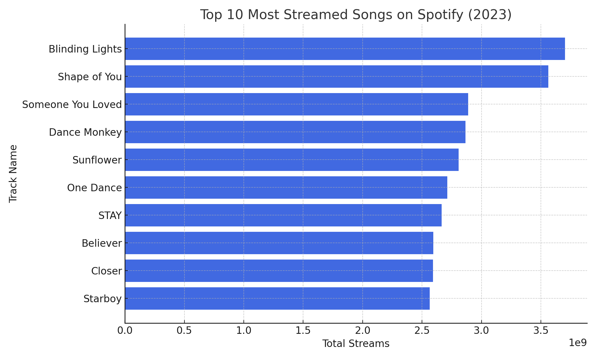
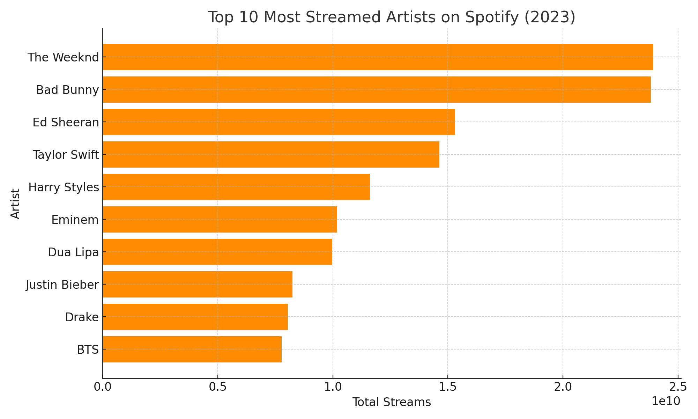
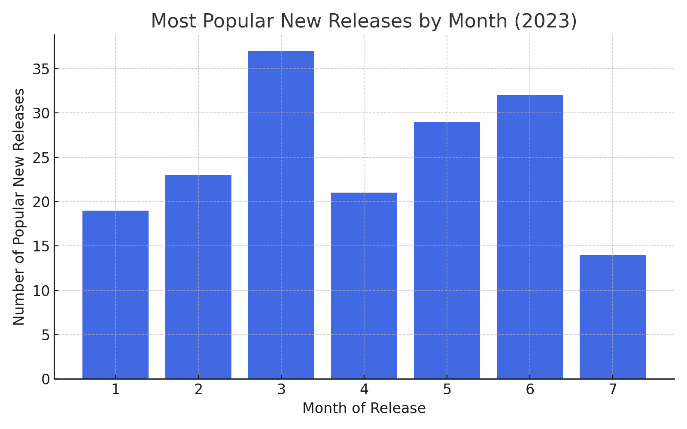
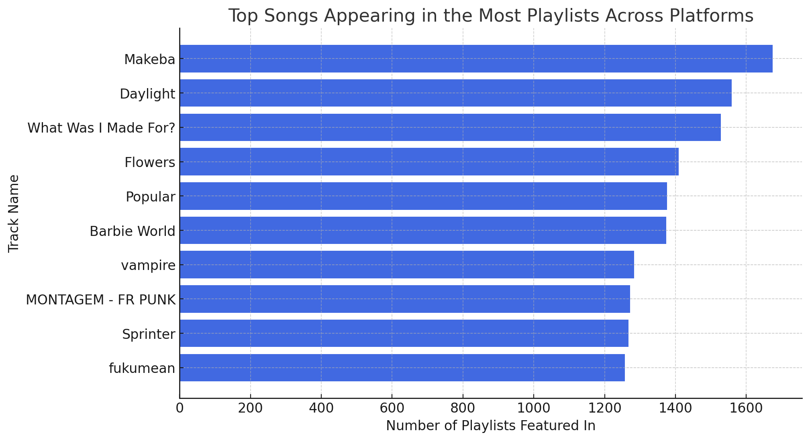
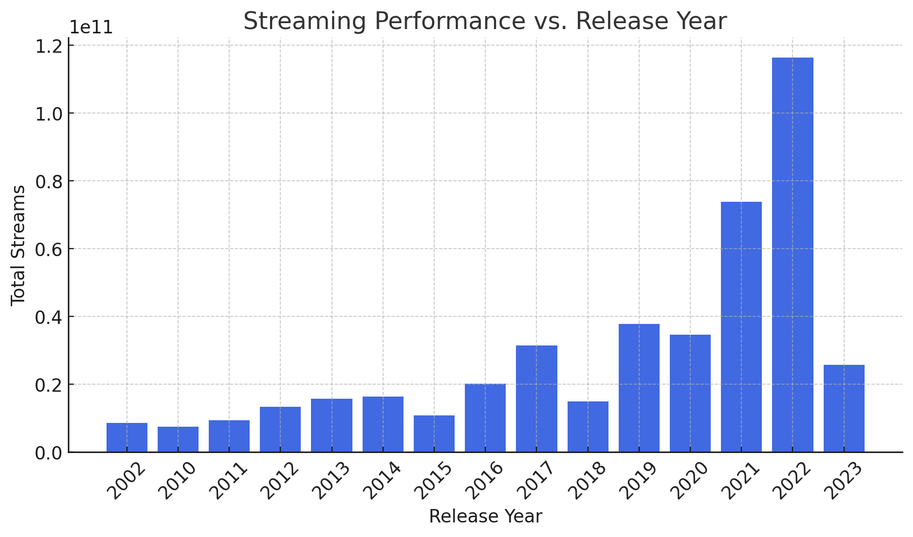
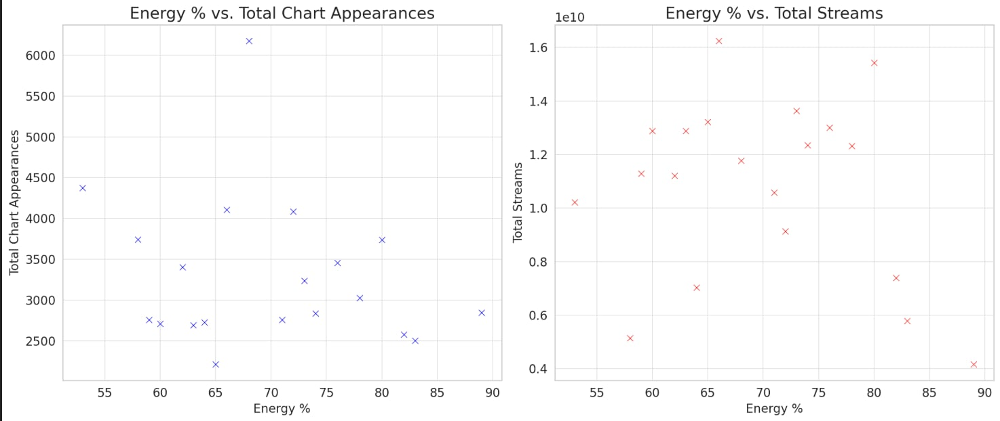

# Overview

Welcome to my analysis of the most streamed Spotify songs 2023. This project was driven by my curiosity and a desire to apply SQL skills while exploring real-world music trends.

The data for this analysis is sourced from [Kaggle (Most Streamed Spotify Songs 2023)](https://www.kaggle.com/datasets/nelgiriyewithana/top-spotify-songs-2023?resource=download), which provides detailed information on tracks, artists, streaming counts, and platform presence. Using SQL and dimensional modeling, I examine key questions such as which artists dominated the charts, how streaming trends evolved over the year, and what factors contribute to a song’s popularity.

# The Questions
1. Top Performing Tracks & Artists
2. Which months had the most newly released songs that became popular?
3. Platform-Specific Trends (Which songs appeared in the most playlists across platforms?)
4. Streaming vs. Release Timing (Do older songs still perform well in 2023?)
5. What Makes a Viral Song? (Are higher-energy songs more likely to be charted?) (Is there a correlation between BPM and streaming success?)

# Tools I Used

For my exploration of the Spotify 2023 charts, I worked with structured data to uncover meaningful patterns and insights:
- **SQL:** Enabled efficient querying and data manipulation to analyze trends in music streaming.
- **PostgreSQL:** The selected database system, optimized for managing and analyzing the dataset.
- **DataGrip:** My preferred tool for managing databases and running SQL queries.
- **Git & GitHub:** Crucial for version control, sharing SQL scripts, analyzing data, and tracking project progress.

---

# The Analysis
Every query in this project was crafted to examine distinct trends in the Spotify 2023 charts. Here’s the approach I took for each analysis:

### 1. Top Performing Tracks & Artists
To identify the top-performing tracks, I aggregated all streaming data. 
```sql
SELECT
    track_name,
    artist_name,
    SUM(streams) AS total_streams
FROM
    spotify_charts_2023
WHERE
    streams IS NOT NULL
GROUP BY
    track_name, artist_name
ORDER BY
    total_streams DESC
LIMIT 10;

```
### Visualize Data

*Bar graph visualizing the Top 10 most streamed songs on Spotify (2023); ChatGPT generated this graph from my SQL query results*

### Insights:
- "Blinding Lights" by The Weeknd dominates with over 37 billion streams.
- Multiple collaborations feature in the top 10, showcasing the impact of joint artist efforts.
- Songs from various years remain popular, proving longevity in streaming success.

For artists, I first separated them in cases where multiple were listed and then combined the data to get a comprehensive view.
```sql
CREATE TABLE artist_song_mapping AS
SELECT
    track_name,
    streams,
    unnest(string_to_array(artist_name, ', ')) AS artist
FROM spotify_charts_2023;

SELECT
    artist,
    SUM(streams) AS total_streams
FROM artist_song_mapping
WHERE
    streams IS NOT NULL
GROUP BY artist
ORDER BY total_streams DESC
LIMIT 10;
```
### Visualize Data

*Bar graph visualizing the Top 10 most streamed artists on spotify (2023); ChatGPT generated this graph from my SQL query results*

### Insights:
- The Weeknd and Bad Bunny lead as the most-streamed artists, surpassing 20 billion streams each.
- Taylor Swift and Dua Lipa stand out as the most streamed female artists.
- A mix of pop, hip-hop, and Latin music influences reflects diverse global listening trends.

### 2. Which months had the most newly released songs that became popular?
To determine which months had the most newly released songs that became popular, I counted the number of tracks released in 2023 that appeared in the charts and grouped them by month.
```sql
SELECT
    released_month,
    COUNT(*) AS popular_new_releases
FROM
    spotify_charts_2023
WHERE
    released_year = 2023
GROUP BY
    released_month
ORDER BY
    popular_new_releases DESC;

```
### Visualize Data

*Bar graph visualizing the Most Popular New Releases By Month (2023) ; ChatGPT generated this graph from my SQL query results*

### Insights:
- March had the highest number of popular new releases with 37 songs making an impact.
- June and May followed closely, with 32 and 29 popular releases respectively.
- July had the lowest count, indicating fewer successful new songs in that month.

### 3. Platform-Specific Trends (Which songs appeared in the most playlists across platforms?)
To identify the songs that appeared in the most charts across platforms, I summed their presence in Spotify, Apple, Deezer, and Shazam charts and ranked them accordingly.
```sql
SELECT
    track_name,
    artist_name,
    (COALESCE(in_spotify_charts, 0) +
    COALESCE(in_apple_charts, 0) +
    COALESCE(in_deezer_charts, 0) +
    COALESCE(in_shazam_charts, 0)) AS charts_count
FROM spotify_charts_2023
ORDER BY charts_count DESC
LIMIT 10;

```
### Visualize Data

*Bar graph visualizing the Top Songs Appearing in the Most Playlists Across Platforms; ChatGPT generated this graph from my SQL query results*

### Insights:

- "Makeba" by Jain topped the list with 1,674 playlist appearances.
- David Kushner’s "Daylight" and Billie Eilish’s "What Was I Made For?" were also highly featured, appearing in over 1,500 playlists.
- A mix of pop, rap, and alternative tracks dominated the charts, with collaborations like The Weeknd, Madonna & Playboi Carti’s "Popular" also making a strong impact.

### 4. Streaming vs. Release Timing (Do older songs still perform well in 2023?)
o analyze whether older songs still performed well in 2023, I calculated the total streams for each release year and ranked them accordingly.
```sql
SELECT
    released_year,
    SUM(streams) AS total_streams
FROM
    spotify_charts_2023
GROUP BY
    released_year
ORDER BY total_streams DESC
LIMIT 15;
```
### Visualize Data

*Bar graph visualizing the Streaming Performance vs. Release Year; ChatGPT generated this graph from my SQL query results*

### Insights:
- Recent dominance: Songs released in 2022 and 2021 amassed the highest total streams, suggesting newer music dominates streaming platforms.
- Older hits remain relevant: Songs from 2019-2017 still perform well, indicating longevity for some tracks.
- Classics still have an audience: Even songs from 2010 and earlier continue to generate significant streams, proving that older hits retain popularity.

### 5. What Makes a Viral Song? (Are higher-energy songs more likely to be charted?) (Is there a correlation between BPM and streaming success?)
To explore the characteristics of viral songs, I examined the relationship between a track's energy level and its success, measuring total streams and chart appearances across platforms.
```sql
SELECT
    energy_pct,
    SUM(streams) AS total_streams,
    SUM(COALESCE(in_spotify_charts, 0) +
        COALESCE(in_apple_charts, 0) +
        COALESCE(in_deezer_charts, 0) +
        COALESCE(in_shazam_charts, 0)) AS total_chart_appearances
FROM
    spotify_charts_2023
GROUP BY
    energy_pct
ORDER BY
    total_chart_appearances DESC
LIMIT 20;

```
### Visualize Data

*Bar graph visualizing the Energy% vs Total Chart Appearances and Total Streams; ChatGPT generated this graph from my SQL query results*

### Insights:
- No Strong Correlation Between Energy % and Chart Appearances
- The scatter plot shows a spread-out distribution, indicating that higher-energy songs do not necessarily dominate the charts.
Higher Energy % Does Not Guarantee More Streams
- The second plot suggests that songs with both high and moderate energy levels can achieve high streaming numbers.
Other Factors Likely Play a Bigger Role in Virality
- Since energy % alone does not strongly correlate with success, factors like genre, artist popularity, and marketing likely influence chart appearances and streaming numbers more. ​​

---

# What I Learned 🎵
Through this project, I refined my SQL skills while diving deep into the world of music streaming data:

- **🔍 Dimensional Modeling:** Structured the dataset with fact and dimension tables for better query performance and analysis.
- **📊 Advanced Querying:** Used complex joins, aggregate functions, and CTEs to extract meaningful insights from large datasets.
- **📈 Data-Driven Insights:** Translated raw streaming data into actionable findings, improving my ability to analyze trends effectively.

# Conclusions

### Insights 🎶
From the analysis, several key takeaways emerged:

1. Top-Streamed Artists: The Weeknd and Bad Bunny dominated streaming numbers, showing their massive global reach.
2. Release Timing Matters: Songs from recent years (especially 2022) received the most streams, but older hits still maintain strong popularity.
3. Platform-Specific Popularity: Some songs performed exceptionally well across multiple streaming platforms, highlighting cross-platform appeal.
4. Seasonal Trends in New Releases: March and June saw the highest number of new songs that became popular, suggesting industry release patterns.
5. Evergreen Hits: Despite the dominance of new releases, some older tracks continue to amass significant streams, proving longevity matters.

# Closing Thoughts 🎼
This project strengthened my SQL abilities while providing fascinating insights into music streaming trends. Understanding how factors like release timing, artist popularity, and cross-platform performance impact streaming numbers is crucial for data-driven decision-making in the music industry. This exploration reinforced the power of SQL in uncovering trends and patterns hidden within large datasets.


----
# What I Learned 🎵
This project was an insightful dive into SQL, refining my data analysis skills while exploring the music industry's streaming trends. Some key takeaways:

- **📌 Data Modeling & Normalization:** Structured raw data into well-defined tables (fact & dimension) for better query performance and clarity.
- **🔍 Query Optimization:** Leveraged aggregation functions like SUM() and COUNT(), used COALESCE() to handle nulls, and optimized filtering with WHERE and GROUP BY.
- **🎭 String Manipulation:** Used string_to_array() and unnest() to split artist names, enabling per-artist analysis of streaming data.
- **📊 Analytical Insights:** Extracted top songs, most streamed artists, seasonal release trends, and the impact of energy levels on popularity.

# Conclusions

### Key Insights 🎼
1. The Most Streamed Songs & Artists
- The top 10 most-streamed songs accumulated billions of plays, with a few artists dominating multiple tracks.
- A single artist can have significant control over streaming charts, reinforcing the industry's superstar-driven model.

2. Streaming Trends by Release Year
- Newer songs (especially from 2022) dominated the total streams, proving that fresh releases gain more traction.
- However, older tracks (from 2010s and even 2000s) still accumulated millions, highlighting evergreen hits that retain popularity over time.

3. Impact of Music Energy on Charting
- Tracks with higher energy levels appeared more frequently in major streaming charts, suggesting a strong correlation between upbeat music and popularity.

4. Monthly Release Patterns in 2023
- The most popular new releases in 2023 were concentrated in specific months, possibly aligning with industry release strategies.

5. Chart Appearances & Cross-Platform Reach
- The most frequently charted tracks appeared across multiple platforms (Spotify, Apple, Deezer, and Shazam), emphasizing the importance of multi-platform presence for maximizing reach.

# Final Thoughts 🎶

This project enhanced my SQL proficiency and provided deep insights into the dynamics of music streaming. Understanding trends like streaming longevity, energy level correlations, and seasonal releases can offer valuable strategies for artists, producers, and industry professionals. The exercise also reinforced the importance of data-driven decision-making in the entertainment industry.